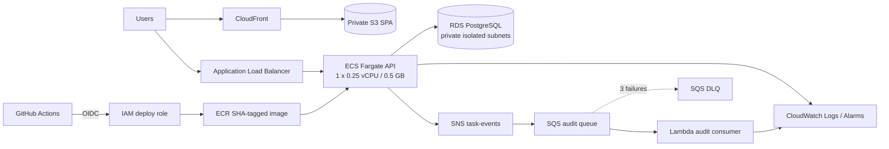

# CloudTask — AWS DevOps & Cloud Engineering Platform

Production-inspired, cost-optimized deployment of a full-stack task application on AWS.

## Highlights

- Infrastructure as Code with Terraform
- CI/CD with GitHub Actions and AWS OIDC
- Docker images stored in Amazon ECR
- Node.js API on Amazon ECS Fargate behind an ALB
- React frontend on S3 + CloudFront
- PostgreSQL on private Amazon RDS subnets
- SNS/SQS/DLQ event-driven workflow
- CloudWatch monitoring and SNS alerts
- AWS Config governance checks
- Designed for a short-lived AWS demo with a target spend below $5

CloudTask is a **production-inspired, cost-optimized portfolio architecture**, not a claim of a fully production-grade live environment. The task app is deliberately small so the repository can foreground architecture, delivery, security, operations, and cost engineering.

## Architecture



The ALB spans two public subnets. For the short demo only, the Fargate task also runs in public subnets with a public IP so it can reach AWS APIs without a NAT Gateway. Its security group has no public ingress: port 3000 is allowed only from the ALB security group. RDS uses two isolated subnet placements with no internet route and accepts PostgreSQL only from the ECS security group.

## Repository map

```text
apps/frontend                 React, TypeScript, Vite, Tailwind
apps/api                      Express, Prisma, JWT, API tests, Dockerfile
functions/audit-consumer      TypeScript SQS/Lambda consumer and tests
infra/bootstrap/terraform     state S3, ECR, GitHub OIDC role, $5 budget
infra/terraform/modules       network, frontend, ECS/ALB, RDS, messaging,
                              observability, governance
infra/terraform/environments/demo  disposable demo composition
.github/workflows             CI and manual deploy/destroy pipelines
docs                          architecture notes, runbook, evidence checklist
```

## Local setup

Requirements: Node.js 22+, npm, and PostgreSQL 16 (or Docker).

```bash
cp .env.example .env
npm ci
npm run prisma:generate -w @cloudtask/api
docker compose up -d postgres
npm run prisma:migrate -w @cloudtask/api
npm run prisma:seed -w @cloudtask/api
npm run dev -w @cloudtask/api
npm run dev -w @cloudtask/frontend
```

Open `http://localhost:5173`. The seed account is `demo@cloudtask.local` / `DemoPassword123!` and is only local non-sensitive sample data. Or run the complete stack with `docker compose up --build`. The API container applies committed Prisma migrations before starting.

Important environment variables:

| Variable            | Purpose                                              |
| ------------------- | ---------------------------------------------------- |
| `DATABASE_URL`      | PostgreSQL connection string                         |
| `JWT_SECRET`        | 32+ character signing secret                         |
| `CORS_ORIGIN`       | comma-separated allowed browser origins              |
| `SNS_TOPIC_ARN`     | optional; absent uses a safe local structured logger |
| `AWS_REGION`        | SDK region, default `us-east-1`                      |
| `VITE_API_BASE_URL` | frontend API origin; never hardcoded for production  |

## Application and API

Register and login use bcrypt password hashing and one-hour JWTs. Tasks are always filtered by authenticated user. Input is validated with Zod, and Helmet, bounded JSON input, configured CORS, centralized errors, and production-safe responses provide sensible baseline security.

| Method             | Path                 | Purpose                                   |
| ------------------ | -------------------- | ----------------------------------------- |
| `GET`              | `/health`            | process liveness                          |
| `GET`              | `/ready`             | readiness including database connectivity |
| `POST`             | `/api/auth/register` | create account                            |
| `POST`             | `/api/auth/login`    | issue JWT                                 |
| `GET/POST`         | `/api/tasks`         | list/create current user's tasks          |
| `GET/PATCH/DELETE` | `/api/tasks/:id`     | read/update/delete owned task             |

A successful task creation publishes a non-sensitive `task.created` event when SNS is configured. SNS wraps the event for SQS. Lambda validates both the envelope and event, writes structured audit logs, and returns partial batch failures so malformed messages retry and move to the DLQ after three receives.

## Quality commands

```bash
npm run lint
npm test
npm run build
docker build -f apps/api/Dockerfile -t cloudtask-api:local .
terraform fmt -check -recursive infra
terraform -chdir=infra/bootstrap/terraform init -backend=false
terraform -chdir=infra/bootstrap/terraform validate
terraform -chdir=infra/terraform/environments/demo init -backend=false
terraform -chdir=infra/terraform/environments/demo validate
```

All tests use in-memory collaborators and mocked fetch; no AWS credentials or services are called.

## Terraform and bootstrap

The bootstrap state is deliberately separate because it owns the remote-state bucket, immutable ECR repository, OIDC trust/deploy role, and optional budget. It supports either creating GitHub's account-level OIDC provider or reusing an existing ARN, preventing accidental duplicates.

1. Copy `infra/bootstrap/terraform/terraform.tfvars.example` to `terraform.tfvars` and set owner, exact `ORG/REPO`, OIDC choice, and optional budget email.
2. From `infra/bootstrap/terraform`, run `terraform init`, `terraform plan -out bootstrap.tfplan`, inspect it, then manually run `terraform apply bootstrap.tfplan`.
3. Record `state_bucket_name`, `ecr_repository_url`, and `github_deployment_role_arn` outputs.
4. Configure GitHub environment `demo` with protection reviewers. Add repository/environment variables: `AWS_DEPLOY_ROLE_ARN`, `ECR_REPOSITORY_URL`, `TF_STATE_BUCKET`, `PROJECT_OWNER`, and optional `ALERT_EMAIL`.
5. Commit only examples—never `terraform.tfvars`, plans, state, credentials, or secrets.

The OIDC trust accepts only this repository's `main` ref or protected `demo` environment subject and `sts.amazonaws.com` audience. No permanent AWS access keys are used. The Terraform deployment policy necessarily has broad resource scope for create-time resources whose ARNs do not yet exist; its permitted services/actions are bounded to this architecture. A production platform should split plan/apply roles and enforce account guardrails or permissions boundaries.

## CI/CD flow

CI runs on PRs and `main`: install → lint → test → build → Docker build → Trivy HIGH/CRITICAL scan → Terraform format/validate. It needs no AWS identity.

Deployment and destruction are `workflow_dispatch` only. Deployment uses OIDC, pushes an immutable commit-SHA image, plans and applies Terraform, builds the SPA against the deployed ALB URL, syncs S3, invalidates CloudFront, and smoke-tests `/health`. Destruction requires the exact input `DESTROY` and preserves bootstrap resources.

## Manual demo sequence

1. Complete bootstrap and GitHub variable setup above.
2. Push reviewed code to `main` and confirm CI is green.
3. Run **Deploy demo** with governance off for normal evidence; enable it only briefly when collecting Config evidence.
4. Confirm the SNS alert email subscription if configured.
5. Open workflow outputs, CloudFront, and the ALB `/health`; register a demo user and create a task.
6. Collect the checklist in [docs/evidence/README.md](docs/evidence/README.md).
7. Run resilience demonstrations below if desired.
8. Run **Destroy demo** with `DESTROY` the same day and perform the post-destroy billing/resource checks.

## Observability and resilience demonstrations

API and Lambda logs are JSON-friendly and retained for one day. Alarms cover ALB 5XX and sustained ECS CPU, notifying an optional SNS email topic. Container Insights is deliberately disabled.

- Stop the only ECS task in the console. The service scheduler should launch a replacement and the ALB target should return healthy.
- Publish an intentionally malformed message through the task-events SNS topic (or queue for targeted testing). Lambda should return the record as failed; after three receives it should appear in the DLQ.
- Attempt a direct connection to the RDS endpoint from the internet. It should time out because `publicly_accessible=false`, the subnets have no internet route, and port 5432 accepts only the ECS security group.

These are instructions for a later live demo; this repository build does not execute cloud tests.

## Cost strategy and teardown

The design avoids the usual demo cost trap: there is no NAT Gateway or Elastic IP. It defaults to one 0.25-vCPU/0.5-GB task, `db.t4g.micro` Single-AZ PostgreSQL with 20 GiB gp3, one-day logs, PriceClass_100 CloudFront, and Config disabled. Use no more than two roughly six-hour sessions and tear down the same day. Exact pricing varies; see [COST.md](COST.md). AWS Budgets sends alerts near $1, $3, and $4.50—it is not a spending cap.

Destroy the demo through the workflow, verify the listed regional/global services, then separately clean bootstrap only after remote state is no longer needed. Detailed commands and failure handling are in [docs/runbook.md](docs/runbook.md).

## Security decisions

OIDC removes long-lived CI keys. Separate ECS execution, ECS application, Lambda, and GitHub roles divide responsibilities. SSM SecureString injects the database URL; RDS is isolated; security-group references chain ALB→ECS→RDS; S3 is private behind CloudFront OAC; images are immutable and scanned. Terraform-generated passwords still exist in encrypted Terraform state—production should use Secrets Manager rotation or RDS-managed credentials and tightly controlled state. See [SECURITY.md](SECURITY.md).

## Production upgrade path

Move ECS to private subnets and add carefully costed NAT Gateways or VPC endpoints; run at least two tasks across AZs with autoscaling; use RDS Multi-AZ, backups, deletion protection, and managed secret rotation; add Route 53, ACM, HTTPS-only ALB, WAF, longer log retention, continuous Config governance, centralized telemetry, and blue/green or canary deployments. Add a custom domain to eliminate the split CloudFront/ALB origin experience.

## Interview talking points

- Why public-IP Fargate with SG chaining is a conscious no-NAT demo trade-off, not the production default.
- How liveness, readiness, ALB health, ECS desired state, and SQS redrive combine into self-healing behavior.
- Why OIDC, immutable SHA tags, manual environments, plans, scans, and deterministic teardown reduce delivery risk.
- Why SNS→SQS decouples task creation from audit processing and how partial batch failure enables DLQ evidence.
- Where secret material appears in Terraform state and how the production design would remove or rotate it.
