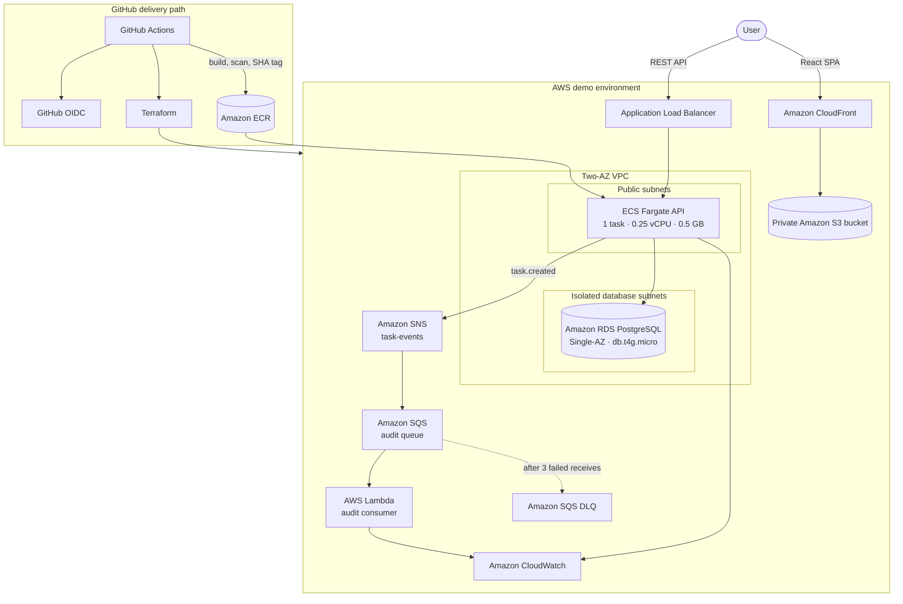

# CloudTask — AWS DevOps & Cloud Engineering Platform

**A production-inspired, cost-optimized AWS platform that demonstrates full-stack delivery, Infrastructure as Code, container orchestration, event-driven processing, observability, security, and repeatable teardown.**

[](https://github.com/dev-kithsara/cloudtask-aws-devops-platform/actions/workflows/ci.yml)


CloudTask uses a straightforward task-management application as the workload for a broader cloud engineering project. The application is intentionally simple; the main engineering signal is the platform around it: Terraform modules, secure AWS networking, GitHub OIDC, automated validation, immutable container delivery, asynchronous processing, monitoring, failure recovery, and cost-controlled cleanup.

> **Portfolio scope:** This is a production-inspired demo architecture, not a claim of a continuously running production environment. It is designed for short evidence-collection sessions with same-day teardown and a target AWS spend below $5.

## What this project demonstrates

| Engineering area       | Implementation evidence                                                                                                        |
| ---------------------- | ------------------------------------------------------------------------------------------------------------------------------ |
| Cloud architecture     | Two-AZ VPC, internet-facing ALB, ECS Fargate, isolated RDS subnets, private S3 origin, and CloudFront                          |
| DevOps delivery        | GitHub Actions, Docker build, Trivy scanning, ECR SHA tags, Terraform plan/apply/destroy, and smoke testing                    |
| Infrastructure as Code | Reusable Terraform modules, environment composition, remote-state bootstrap, variables, outputs, and common tags               |
| Identity and security  | GitHub OIDC, separate runtime roles, SSM SecureString, security-group chaining, non-root containers, and private data services |
| Event-driven design    | `task.created` events through SNS, SQS, Lambda, retry handling, and a dead-letter queue                                        |
| Observability          | Structured application logs, short-retention CloudWatch log groups, ALB 5XX and ECS CPU alarms, and SNS alerts                 |
| Resilience             | ECS desired-state recovery, ALB health checks, readiness checks, queue retries, and DLQ isolation                              |
| Governance             | Optional, narrowly scoped AWS Config checks for S3 encryption and versioning                                                   |
| Cost engineering       | No NAT Gateway, one small Fargate task, Single-AZ RDS, manual deployments, budget alerts, and automated teardown               |

## Architecture



### Network security path

```text
Internet
   |
   v
ALB security group :80
   |  only referenced source
   v
ECS security group :3000
   |  only referenced source
   v
RDS security group :5432
```

The demo deliberately runs Fargate in public subnets with `assign_public_ip=true` to avoid NAT Gateway cost. The task still has no direct internet ingress: only the ALB security group can reach the API port. RDS is not publicly accessible, has no internet route, and accepts PostgreSQL traffic only from the ECS security group.

## Deliberate cost constraints

| Component      | Demo configuration                    | Cost rationale                                                      |
| -------------- | ------------------------------------- | ------------------------------------------------------------------- |
| NAT Gateway    | Not deployed                          | Avoids hourly and data-processing charges                           |
| ECS Fargate    | One task, 0.25 vCPU, 0.5 GB           | Smallest practical API footprint                                    |
| RDS PostgreSQL | `db.t4g.micro`, Single-AZ, 20 GiB gp3 | Disposable portfolio workload rather than high availability         |
| CloudWatch     | One-day log retention                 | Enough time to collect evidence without retaining logs indefinitely |
| AWS Config     | Disabled by default                   | Enabled only briefly for governance evidence                        |
| ECR            | Immutable tags and lifecycle cleanup  | Prevents uncontrolled image accumulation                            |
| Deployment     | Manual `workflow_dispatch`            | Avoids creating paid resources on every push                        |
| Teardown       | Guarded manual workflow               | Enforces deliberate same-day cleanup                                |

The bootstrap layer can create a $5 monthly AWS Budget with alerts at approximately $1, $3, and $4.50. AWS Budgets are delayed alerts, **not hard spending caps**. See [COST.md](COST.md) for the complete cost model.

## Application capabilities

The React dashboard supports:

- registration and login;
- JWT-based authenticated sessions;
- creating, reading, editing, completing, filtering, and deleting tasks;
- `LOW`, `MEDIUM`, and `HIGH` priorities;
- optional descriptions and due dates;
- loading, empty, error, authenticated, and unauthenticated states.

The API provides:

- bcrypt password hashing;
- Zod request validation;
- user-scoped data access;
- centralized structured errors;
- Helmet, configured CORS, and bounded JSON request bodies;
- process liveness and database readiness endpoints;
- dependency-injected event publishing so local tests never require AWS credentials.

## Technology stack

| Layer            | Technologies                                                 |
| ---------------- | ------------------------------------------------------------ |
| Frontend         | React, TypeScript, Vite, Tailwind CSS, React Testing Library |
| API              | Node.js 22, TypeScript, Express, Prisma, Zod, JWT, bcryptjs  |
| Data             | PostgreSQL locally and Amazon RDS PostgreSQL in AWS          |
| Async processing | AWS SDK v3, SNS, SQS, DLQ, Lambda                            |
| Testing          | Vitest, Supertest, React Testing Library                     |
| Containers       | Docker multi-stage build and Docker Compose                  |
| Infrastructure   | Terraform with reusable modules                              |
| Delivery         | GitHub Actions, GitHub OIDC, Amazon ECR, Trivy               |

## Repository structure

```text
cloudtask-aws-devops-platform/
├── apps/
│   ├── frontend/                 # React SPA
│   └── api/                      # Express API, Prisma schema, migrations, tests
├── functions/
│   └── audit-consumer/           # SQS-triggered Lambda and tests
├── infra/
│   ├── bootstrap/terraform/      # state bucket, ECR, OIDC role, budget
│   └── terraform/
│       ├── modules/              # network, frontend, ECS/ALB, RDS, messaging,
│       │                         # observability, governance
│       └── environments/demo/    # disposable demo composition
├── .github/workflows/
│   ├── ci.yml
│   ├── deploy-demo.yml
│   └── destroy-demo.yml
├── docs/
│   ├── architecture/
│   ├── evidence/
│   └── runbook.md
├── docker-compose.yml
├── Makefile
├── COST.md
├── SECURITY.md
└── README.md
```

## Run locally

### Prerequisites

- Node.js 22 or later
- npm
- Docker Desktop for the recommended PostgreSQL workflow

### Option 1: run the full stack with Docker Compose

```bash
docker compose up --build
```

Open the frontend at `http://localhost:5173`. The API is available at `http://localhost:3000`.

### Option 2: run the application in development mode

```bash
cp .env.example .env
npm ci
npm run prisma:generate -w @cloudtask/api
docker compose up -d postgres
npm run prisma:migrate -w @cloudtask/api
npm run prisma:seed -w @cloudtask/api
npm run dev -w @cloudtask/api
```

In a second terminal:

```bash
npm run dev -w @cloudtask/frontend
```

The optional development seed creates:

```text
Email:    demo@cloudtask.local
Password: DemoPassword123!
```

These values are local sample data only and are not used by the AWS environment.

## Environment variables

Copy `.env.example` to `.env` for local development. Never commit `.env`, credentials, JWTs, Terraform state, plan files, or real secrets.

| Variable            | Used by  | Purpose                                                 |
| ------------------- | -------- | ------------------------------------------------------- |
| `DATABASE_URL`      | API      | PostgreSQL connection string                            |
| `JWT_SECRET`        | API      | JWT signing value with at least 32 characters           |
| `CORS_ORIGIN`       | API      | Comma-separated allowed browser origins                 |
| `PORT`              | API      | HTTP port, default `3000`                               |
| `AWS_REGION`        | API      | AWS SDK region, default `us-east-1`                     |
| `SNS_TOPIC_ARN`     | API      | Optional SNS topic; absence enables a safe local logger |
| `VITE_API_BASE_URL` | Frontend | API origin injected at frontend build time              |

In AWS, Terraform creates SSM SecureString parameters for the database URL and JWT signing secret. ECS injects them into the container through its execution role.

## API reference

| Method   | Endpoint             | Authentication | Purpose                                  |
| -------- | -------------------- | -------------- | ---------------------------------------- |
| `GET`    | `/health`            | No             | Process liveness                         |
| `GET`    | `/ready`             | No             | Database readiness                       |
| `POST`   | `/api/auth/register` | No             | Register and issue a JWT                 |
| `POST`   | `/api/auth/login`    | No             | Authenticate and issue a JWT             |
| `GET`    | `/api/tasks`         | Bearer JWT     | List the current user's tasks            |
| `POST`   | `/api/tasks`         | Bearer JWT     | Create a task and publish `task.created` |
| `GET`    | `/api/tasks/:id`     | Bearer JWT     | Read an owned task                       |
| `PATCH`  | `/api/tasks/:id`     | Bearer JWT     | Update or complete an owned task         |
| `DELETE` | `/api/tasks/:id`     | Bearer JWT     | Delete an owned task                     |

Responses use a consistent structure:

```json
{
  "data": {}
}
```

```json
{
  "error": {
    "code": "VALIDATION_ERROR",
    "message": "Invalid request"
  }
}
```

## Event-driven audit flow

Creating a task publishes a non-sensitive versioned event:

```json
{
  "eventType": "task.created",
  "version": "1",
  "timestamp": "2026-10-05T00:00:00.000Z",
  "data": {
    "taskId": "uuid",
    "userId": "uuid",
    "priority": "HIGH"
  }
}
```

SNS delivers the event to the audit queue. Lambda validates both the SNS envelope and the application event, writes a structured CloudWatch log, and reports malformed records as partial batch failures. After three failed receives, SQS moves the record to the DLQ. Passwords, JWTs, and database credentials are never included in events.

## Quality and validation

```bash
npm run lint
npm test
npm run build
npm run format:check
docker compose config --quiet
docker build -f apps/api/Dockerfile -t cloudtask-api:local .
terraform fmt -check -recursive infra
terraform -chdir=infra/bootstrap/terraform init -backend=false
terraform -chdir=infra/bootstrap/terraform validate
terraform -chdir=infra/terraform/environments/demo init -backend=false
terraform -chdir=infra/terraform/environments/demo validate
```

The test suites cover API liveness/readiness, registration validation, login, unauthorized access, task CRUD, user isolation, publisher invocation, authentication UI behavior, dashboard interaction, and valid/malformed Lambda messages. Tests use in-memory collaborators and mocked network calls; they do not contact AWS.

## CI/CD

### Continuous integration

The `CI` workflow runs on pull requests and pushes to `main`:

```text
npm ci
  -> lint
  -> API, frontend, and Lambda tests
  -> production builds
  -> API container build
  -> Trivy HIGH/CRITICAL scan
  -> Terraform format and validation
```

CI does not require AWS credentials.

### Manual demo deployment

The deployment workflow is intentionally manual and uses a protected GitHub environment:

```text
GitHub OIDC
  -> assume deployment role
  -> build and scan API image
  -> push immutable commit-SHA tag to ECR
  -> Terraform plan and apply
  -> build frontend with the deployed API URL
  -> sync frontend to private S3
  -> invalidate CloudFront
  -> smoke-test /health through the ALB
```

### Guarded destruction

The destroy workflow runs only through `workflow_dispatch` and requires the exact confirmation value `DESTROY`. It destroys the disposable demo environment but deliberately preserves the bootstrap state bucket, ECR repository, OIDC provider or reference, deployment role, and budget.

## Bootstrap before the first deployment

The bootstrap configuration is intentionally separate from the disposable application environment.

```bash
cd infra/bootstrap/terraform
cp terraform.tfvars.example terraform.tfvars
terraform init
terraform fmt -check
terraform validate
terraform plan -out bootstrap.tfplan
terraform apply bootstrap.tfplan
terraform output
```

Review the plan before applying it. Configure these protected GitHub environment or repository variables from the bootstrap outputs:

| GitHub variable       | Value                           |
| --------------------- | ------------------------------- |
| `AWS_DEPLOY_ROLE_ARN` | GitHub OIDC deployment role ARN |
| `ECR_REPOSITORY_URL`  | CloudTask ECR repository URL    |
| `TF_STATE_BUCKET`     | Terraform state bucket name     |
| `PROJECT_OWNER`       | Owner tag value                 |
| `ALERT_EMAIL`         | Optional CloudWatch alarm email |

The bootstrap variables allow an account-level GitHub OIDC provider to be created explicitly or an existing provider ARN to be reused. This prevents attempting to create a duplicate provider.

## Security model

- GitHub Actions uses short-lived OIDC credentials instead of stored AWS access keys.
- ECS execution, ECS application, Lambda, and GitHub deployment responsibilities use separate IAM roles.
- The ECS task can publish only to the project SNS topic.
- The ECS execution role can read only the required SSM parameters.
- The S3 frontend bucket blocks all public access and allows reads only through CloudFront Origin Access Control.
- RDS is encrypted, not public, and reachable only through the ECS security group.
- The runtime container uses a non-root user and excludes development dependencies where practical.
- ECR tags are immutable, and CI scans the image before deployment.
- Application logs and events exclude authentication and database secrets.

Terraform-generated secrets still exist in encrypted Terraform state. A production environment should use RDS-managed credentials or AWS Secrets Manager rotation and tightly restrict state access. See [SECURITY.md](SECURITY.md) for the complete threat and control summary.

## Observability and resilience demonstrations

### ECS self-healing

1. Stop the single running task without deleting the ECS service.
2. Observe the desired count remain at one.
3. Capture the replacement task entering `RUNNING` state.
4. Confirm the replacement target becomes healthy in the ALB target group.

### DLQ behavior

1. Send an intentionally malformed audit event.
2. Observe Lambda reject the record with a structured validation error.
3. Allow the queue to retry it three times.
4. Confirm the message appears in the audit DLQ.

### Database isolation

Attempting to reach the RDS endpoint directly from the internet should time out. Do not weaken the security group for the demonstration; the existing failure proves the control.

These demonstrations are intentionally not executed during local validation. Use [docs/evidence/README.md](docs/evidence/README.md) to capture safe, redacted evidence during a short live session.

## Demo deployment and teardown

1. Apply the bootstrap configuration manually.
2. Configure the protected `demo` GitHub environment and variables.
3. Confirm CI passes on `main`.
4. Dispatch **Deploy demo** with governance disabled by default.
5. Exercise the application and collect evidence.
6. Enable AWS Config only if governance evidence is required.
7. Dispatch **Destroy demo** with `DESTROY` on the same day.
8. Verify ECS, ALB, RDS, Lambda, SQS, SNS, CloudFront, demo S3 buckets, AWS Config, CloudWatch, and VPC resources are gone.
9. Check Billing or Cost Explorer again the next day because AWS cost reporting can lag.

The operational procedure, troubleshooting guidance, and emergency cost shutdown order are documented in [docs/runbook.md](docs/runbook.md).

## Demo trade-offs and production upgrades

| Area              | Cost-optimized demo                                    | Production upgrade                                                    |
| ----------------- | ------------------------------------------------------ | --------------------------------------------------------------------- |
| ECS networking    | Public subnets and public IP, ingress only from ALB SG | Private subnets with NAT Gateways or carefully selected VPC endpoints |
| ECS capacity      | One task                                               | At least two tasks across AZs with autoscaling                        |
| Database          | Single-AZ `db.t4g.micro`, no retained backup           | Multi-AZ, automated backups, deletion protection, larger class        |
| API transport     | HTTP ALB listener for a temporary demo                 | Route 53, ACM certificate, HTTPS listener, and HTTP redirect          |
| Edge security     | CloudFront OAC                                         | AWS WAF on CloudFront and the ALB                                     |
| Governance        | Temporary scoped Config recorder                       | Continuous organization-level governance                              |
| Logging           | One-day retention                                      | Retention based on operational and compliance requirements            |
| Deployment        | ECS rolling update                                     | Blue/green or canary deployment                                       |
| Event consistency | Database write followed by SNS publish                 | Transactional outbox and idempotent consumers                         |
| Secrets           | SSM SecureString backed by Terraform state             | Managed rotation through Secrets Manager or RDS                       |

## Evidence checklist

The public portfolio should eventually include redacted proof of:

- a successful CI run;
- an inspected Terraform plan;
- the SHA-tagged ECR image;
- the running ECS service and healthy ALB target;
- RDS showing `Publicly accessible: No` and the private subnet group;
- CloudFront with its private S3 origin;
- structured API and Lambda logs;
- ALB and ECS CloudWatch alarms;
- SNS, SQS redrive policy, Lambda invocation, and DLQ behavior;
- temporary AWS Config compliance;
- ECS task replacement;
- successful destruction and final billing verification.

Do not publish account IDs, credentials, tokens, unredacted endpoints, Terraform state, or sensitive console URLs.

## Interview summary

> I built CloudTask as a cloud platform rather than only a web application. I containerized the API, stored immutable images in ECR, deployed to ECS Fargate behind an ALB, isolated PostgreSQL in private RDS subnets, and served the React frontend through private S3 and CloudFront. I codified the architecture with reusable Terraform modules and used GitHub Actions with OIDC so the pipeline does not depend on long-lived AWS keys. I also added an SNS-to-SQS event flow with Lambda and a DLQ, CloudWatch monitoring, optional AWS Config checks, and a guarded destroy workflow. The live architecture avoids a NAT Gateway and is intentionally short-lived so I can demonstrate the platform within a controlled student budget.

Useful follow-up topics for a technical interview:

- Why is S3 and CloudFront a better fit for the SPA than a second container?
- Why is demo Fargate public while RDS remains isolated?
- How do OIDC trust conditions prevent another repository from assuming the role?
- What is the difference between ECS, Fargate, ECR, an ALB, and a target group?
- How do the ALB health check and ECS desired count produce self-healing behavior?
- Why use SNS, SQS, partial batch failures, and a DLQ together?
- Which costs dominate a short demo, and how does teardown control them?
- What would change before running this architecture continuously in production?

## Project documentation

- [Architecture decisions](docs/architecture/README.md)
- [Operations and teardown runbook](docs/runbook.md)
- [Evidence collection checklist](docs/evidence/README.md)
- [Cost model and guardrails](COST.md)
- [Security model](SECURITY.md)

## Current status

The application, tests, container definition, Terraform configurations, workflows, and operational documentation are implemented and locally validated. AWS resources are not created automatically by this repository. A real deployment requires deliberate bootstrap, protected GitHub environment configuration, a manual deployment run, evidence collection, and same-day teardown.
