# CloudTask — AWS DevOps Portfolio Evidence

This directory contains recruiter-grade architectural and operational evidence collected during live deployment of the **CloudTask** platform on AWS.

---

## 1. End-to-End Application Delivery

### 1.1 Working Frontend Dashboard (Phase 11)
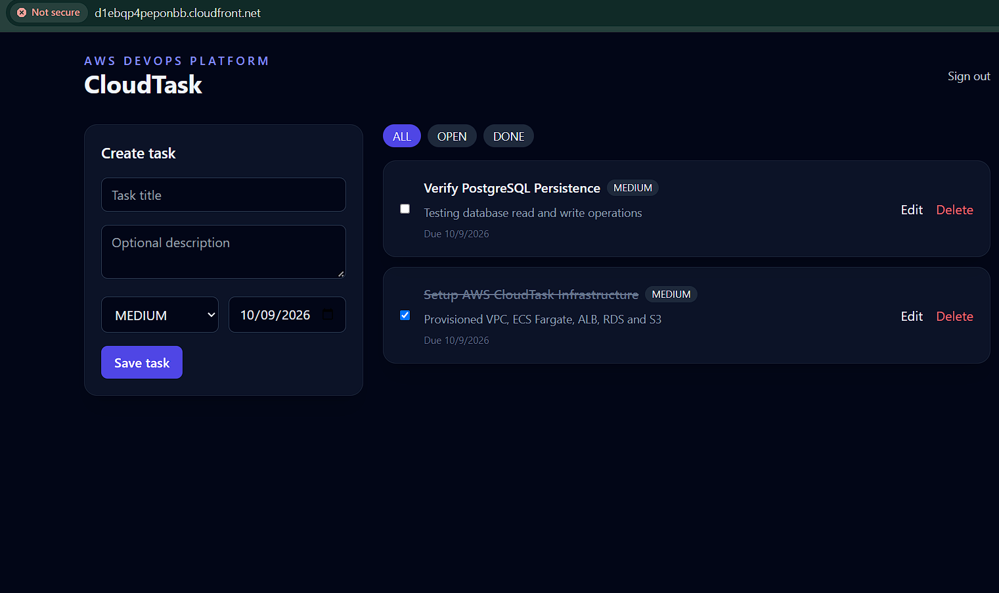
- **Validation**: React SPA loaded over CloudFront CDN. Test tasks created, edited, and verified persisting in PostgreSQL RDS.
- **Proof of Concept**: Full CRUD operations with JWT authentication working against containerized Express API.

### 1.2 GitHub Actions Automated Deployment (Phase 9)
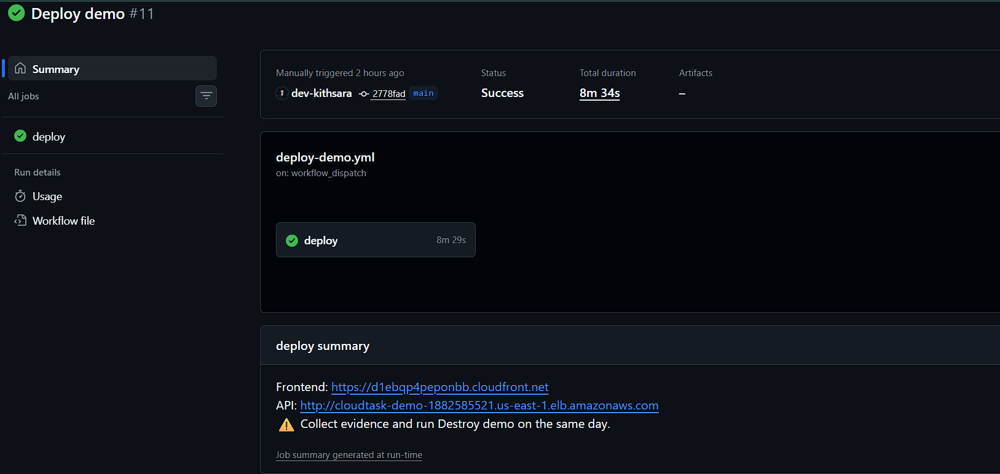
- **Validation**: Manual `workflow_dispatch` pipeline executing OIDC authentication, ECR build/scan/push, Terraform apply, and frontend cache invalidation in 8m 34s with zero human AWS credentials stored in GitHub.

---

## 2. Infrastructure & Container Orchestration

### 2.1 Immutable ECR Image Delivery (Phase 10.1)
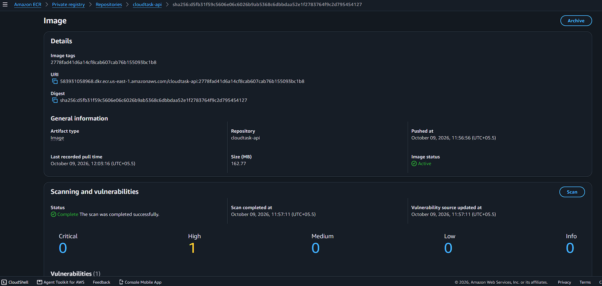
- **Validation**: Container image built, scanned with Trivy, and tagged immutably with the exact Git commit SHA in AWS ECR (`cloudtask-api`).

### 2.2 ECS Fargate Container Orchestration (Phase 10.2)
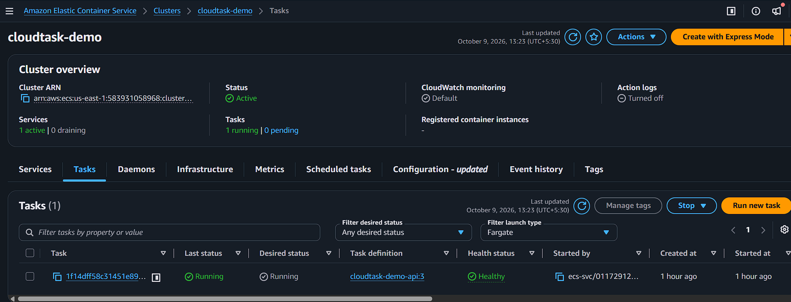
- **Validation**: Serverless compute running on AWS Fargate with task definition CPU/Memory limits, managed execution role, and task role.

### 2.3 Application Load Balancer & Health Checks (Phase 10.3)
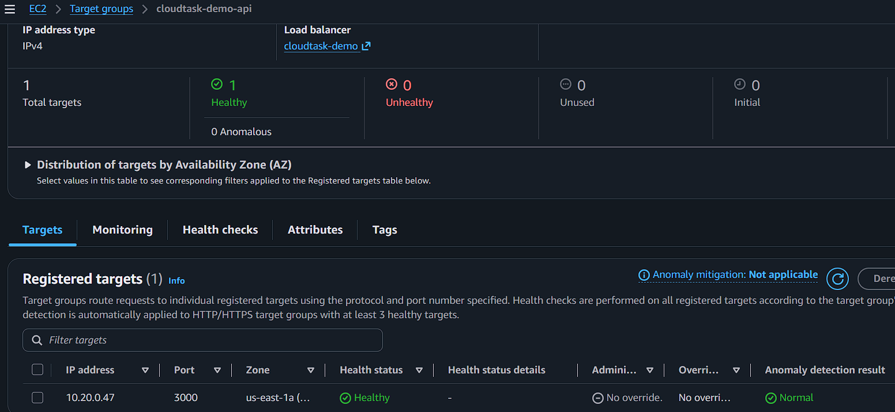
- **Validation**: Internet-facing ALB routing traffic across public subnets to ECS tasks. Target group reports **Healthy** status via `/health` endpoint.

---

## 3. Network & Database Security

### 3.1 RDS PostgreSQL Isolation (Phase 10.5)
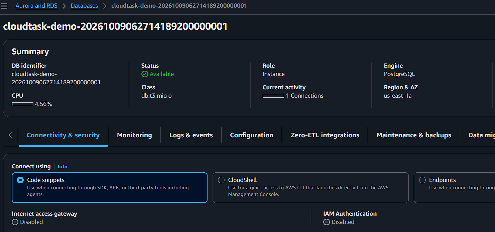
- **Validation**: PostgreSQL RDS instance configured with **`Publicly Accessible: No`** in isolated database subnets. Ingress is restricted solely to the ECS security group on port 5432.

### 3.2 CloudFront CDN & Private S3 Bucket (Phase 10.6)
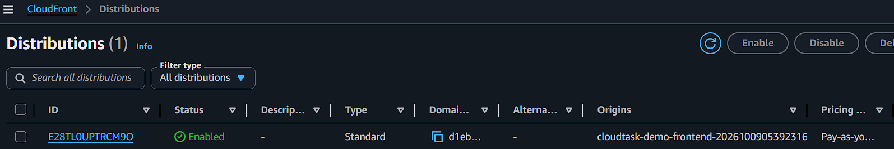
- **Validation**: S3 frontend bucket with Block Public Access enabled. Delivery is served strictly via CloudFront using Origin Access Control (OAC).

---

## 4. Observability & Event-Driven Architecture

### 4.1 CloudWatch Logs & Lambda Audit Consumer (Phase 12.1 & 13.2)
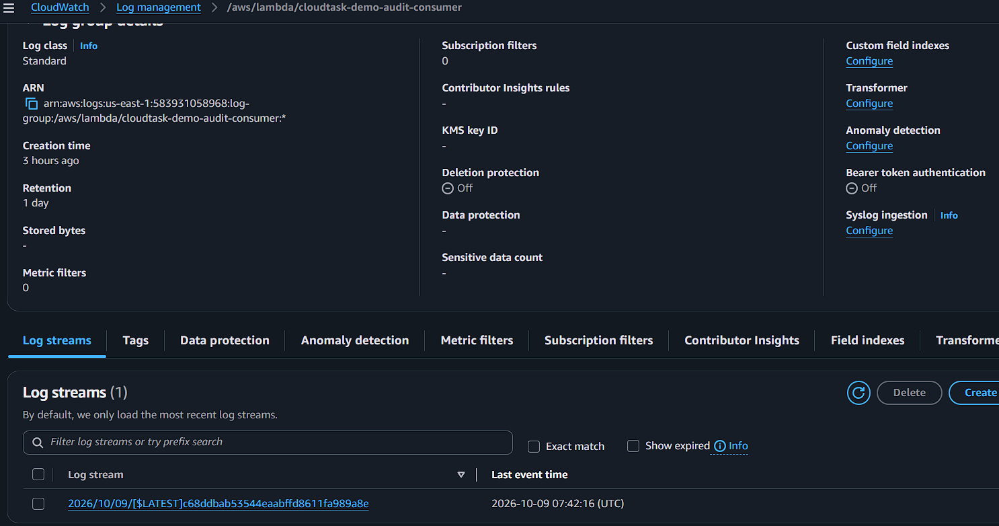
- **Validation**: Structured JSON audit event logs captured in AWS CloudWatch. Demonstrates decoupled event delivery: `API -> SNS -> SQS -> Lambda (Audit Consumer)`.

---

## 5. Resilience & Self-Healing

### 5.1 ECS Self-Healing Task Recovery (Phase 15)
| 1. Task Stopped Manually | 2. Service Scheduler Event | 3. Replacement Task Healthy |
|:---:|:---:|:---:|
| 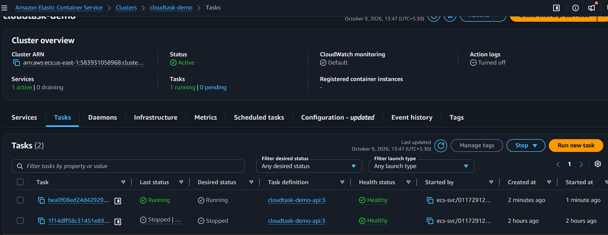 | 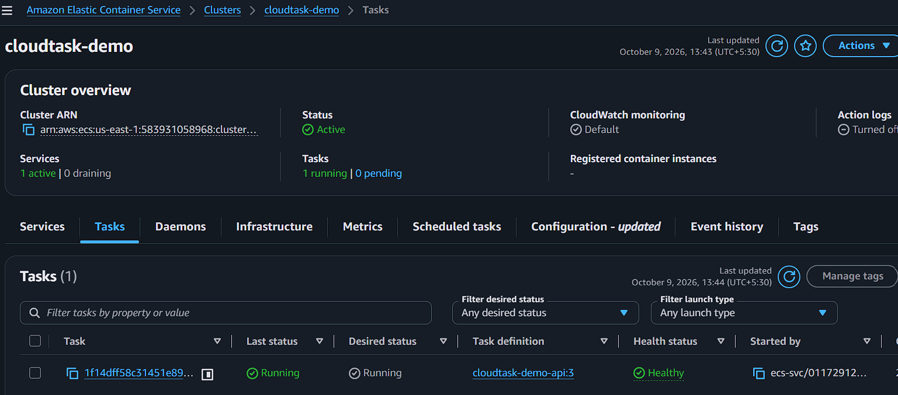 | 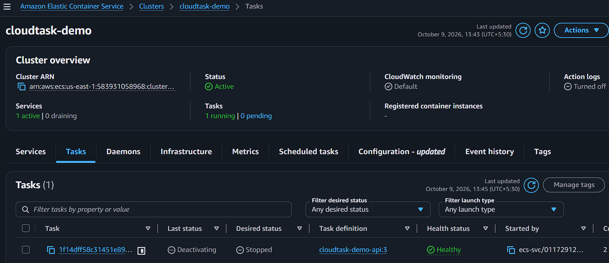 |

- **Validation**: When the running task is manually terminated (`portfolio-self-healing-test`), ECS service reconciliation detects the deviation from `desired_count = 1`.
- **Result**: The ECS scheduler automatically provisions a replacement Fargate task, binds network interfaces, and restores healthy ALB target routing without human intervention.
